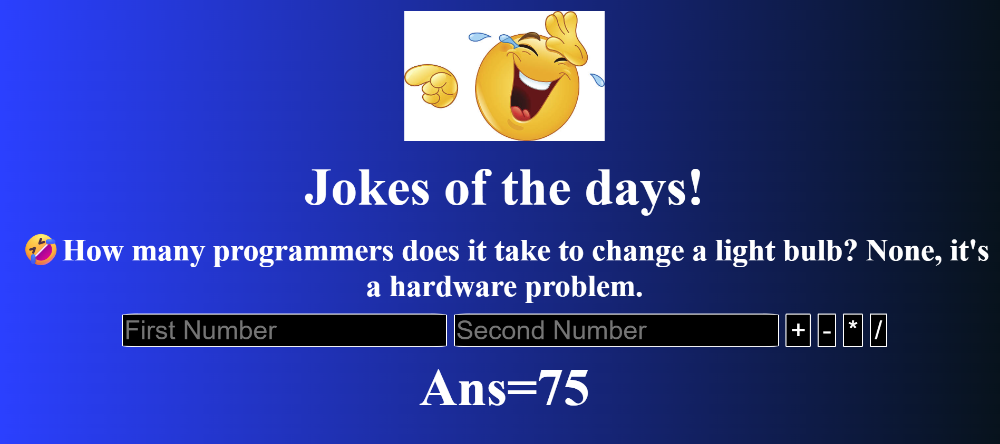

# 🎉 Fun Calculator (Java)

A simple and fun Java-based calculator that performs basic arithmetic operations  
(**Addition, Subtraction, Multiplication, Division**) and also tells a random joke after each calculation.  

This project is a beginner-friendly example of how to use **Java methods, user input, and randomization**.

---
## 🖼️ Screenshots

### 📌 User Interface Preview

|  |  |

## 🚀 Features

- ➕ Addition  
- ➖ Subtraction  
- ✖️ Multiplication  
- ➗ Division  
- 😂 Get a random joke after every result  
- 🧼 Clean and easy-to-understand Java code

---

